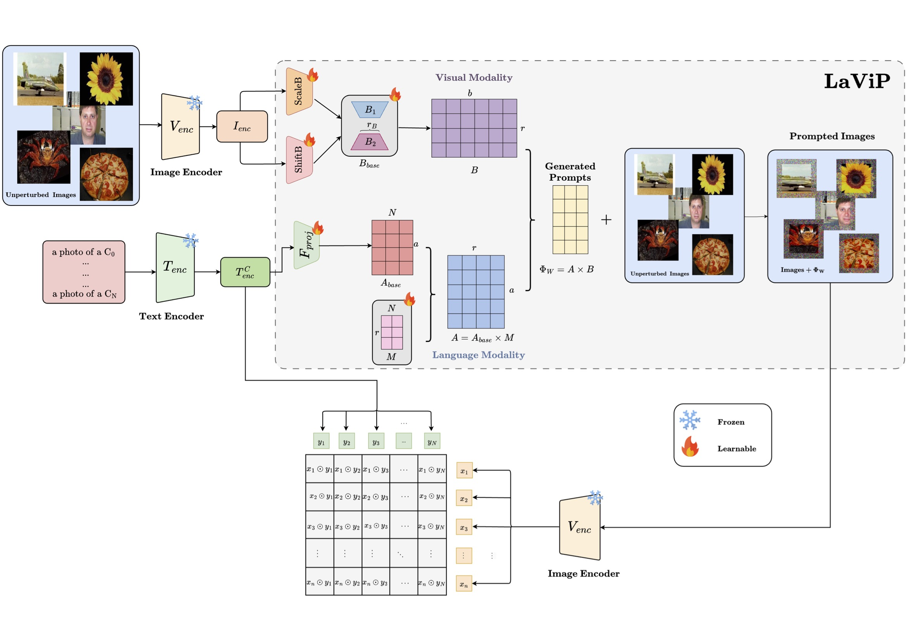

# LaViP: Language-Grounded visual Prompting


This repo contains the official implementation of our AAAI 2024 paper


## Abstract
<p align="center">

</p>

>  We introduce a language-grounded visual prompting method to adapt the visual encoder of vision-language models for downstream tasks. By capitalizing on language integration, we devise a parameter-efficient strategy to adjust the input of the visual encoder, eliminating the need to modify or add to the model's parameters. Due to this design choice, our algorithm can operate even in black-box scenarios, showcasing adaptability in situations where access to the model's parameters is constrained. We will empirically demonstrate that, compared to prior art, grounding visual prompts with language enhances both the accuracy and speed of adaptation. Moreover, our algorithm excels in base-to-novel class generalization, overcoming limitations of visual prompting and exhibiting the capacity to generalize beyond seen classes. We thoroughly assess and evaluate our method across a variety of image recognition datasets, such as EuroSAT, UCF101, DTD, and CLEVR, spanning different learning situations, including few-shot learning, base-to-novel class generalization, and transfer learning.

<br/>

## Research Highlights
<p align="center">

</p>

* **Language-Grounded Input-Dependent Dynamic Visual Prompting:** To our best knowledge, this is the first paper that explores the language-grounded input-dependent visual prompting without using an external model. For this, we devise `low-rank` learnable vectors. The language integration both imporves classification accuracy and `3x` convergence speed.
* **New Algorithm for Extending Visual Prompting to Generlize Beyond Seen Classes:** We propose a  Kronecker based encoding fusion method to generalize visual prompitng method to beyond seen classes during training. 
* **Support for Visual Prompting in gradient free environment:** By equipping language grounded input-aware prompts, LaViP can be utilized in a gradient free environment(ie:where access to model parameters and backpropgation are forbidden) with more thanr `15x` faster convergence.
<!-- * **Empirical Results:** We extensively validate BlackVIP on 16 datasets and demonstrate its effectiveness regarding _few-shot adaptability_ and _robustness on distribution/object-location shift_. -->

<br/>
<hr/>


### _Experiments_
* **main performance** (Tab. 1, Tab. 2 and Tab.3 of paper)
  
  * 12 transfer learning benchmarks - [`Caltech101`, `OxfordPets`, `StanfordCars`, `Flowers102`, `Food101`, `FGVCAircraft`, `SUN397`, `DTD`, `EuroSAT`, `Resisc45`, `CLEVR`, `UCF101`]


<br/>

## Setup
* Run the following commands to create the environment.
  * Note that we slightly modifed the [Dassl.pytorch](https://github.com/KaiyangZhou/Dassl.pytorch) to mm_dassl for flexible experiments.
```shell
# Clone this repo
git clonehttps://github.com/lavip5492/aaai24_5492.git
cd lavip_5492

# Create a conda environment
conda create -y -n lavip python=3.9.16

# Activate the environment
conda activate lavip

# Install torch and torchvision
# Please refer to https://pytorch.org/ if you need a different cuda version
conda install pytorch==1.13.1 torchvision==0.14.1 torchaudio==0.13.1 pytorch-cuda=11.7 -c pytorch -c nvidia


# Install dependencies
cd mm_dassl
pip install -r requirements.txt

```

<br/>

## Data preparation
* To prepare following 10 datasets (adopted by [CoOp](https://github.com/KaiyangZhou/CoOp)), please follow the instruction from https://github.com/KaiyangZhou/CoOp/blob/main/DATASETS.md
  * **Caltech101, OxfordPets, StanfordCars, Flowers102, Food101, FGVCAircraft, SUN397, DTD, EuroSAT, and UCF101**
  * We use the same few-shot split of **CoOp** for above 10 datasets.
* To prepare following three datasets (adopted by [BlackVIP](https://github.com/changdaeoh/BlackVIP)), please follow the instruction from: https://github.com/changdaeoh/BlackVIP/blob/main/README.md
  * **SVHN, Resisc45 and CLEVR**: 

* To prepare **PCam** , we downloaded the data from: https://github.com/basveeling/pcam and adopted `CoOp` style split.


<br/>

## Run
### transfer learning benchmarks
* Move to `lavip_5492/scripts/method_name` directory

* On the targeted dataset, run the commands with dataset-specific configs as below:
```shell
# for few-shot learning {1:dataset,2:epoch,3:init_lr}
sh fsl_train dtd 300 1.0

# for base-to-nove generalization {1:dataset, 2:epoch, 3:init_lr}
sh base2new_train.sh dtd 300 1.0

# for transfer learning {1:dataset, 2:epoch, 3:init_lr}
sh train_full.sh dtd 300 1.0

# for gradient free learning {1:dataset, 2:epoch, 3:moms, 4:gamma, 5:spsa_c}
sh bb_train.sh dtd 300 0.9 0.2 0.005  
# for VP (white-box), specify {1:dataset, 2:epoch, 3:lr}
sh tl_bench.sh svhn 1000 40.0
```


<br/>
<hr />


## Acknowledgements
Our overall experimental pipeline is based on [CoOp, CoCoOp](https://github.com/KaiyangZhou/CoOp) repository. For baseline construction, we bollowed/refered the code from repositories of [VP](https://github.com/hjbahng/visual_prompting), [MaPLe](https://github.com/muzairkhattak/multimodal-prompt-learning),[BAR](https://github.com/yunyuntsai/Black-box-Adversarial-Reprogramming), and [BlackVIP](https://github.com/changdaeoh/BlackVIP). We appreciate the authors (Zhou et al., Bahng et al.,Khattak, M. U. et al., Tsai et al., Oh C et al.) for sharing their code.

